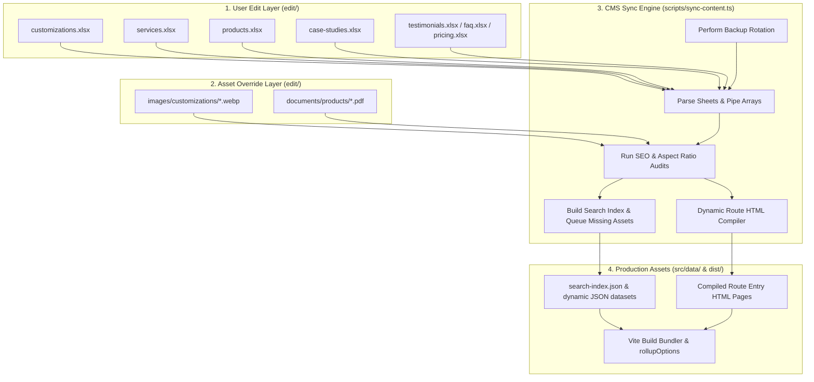

# 🚀 CMS Final Implementation & Production Readiness Report

This report documents the finalized CMS architecture, data workflows, user interfaces, verification tests, performance evaluations, and scalability guidelines for the **Harsh Infotech** website content management system.

---

## 📐 1. System Architecture & Data Flow

Below is the conceptual architecture of the CMS. It shows the non-technical editor workflow on the left, the sync compiler engine in the center, and the bundled React distribution on the right.



---

## 📁 2. Complete CMS Directory Structure

The repository maintains strict isolation between private non-technical content files and public/versioned source code:

```text
/edit (Private, Ignored by Git)
├── backups/               # 30-day rotating archive of XLSX/CSV sources
├── ai-content/            # Staged copy prompts and AI drafts
├── templates/             # Document layouts (DOCX, proposal templates)
├── documents/             # PDFs/brochures (customizations, services, products)
├── images/                # Asset overrides (customizations, services, products, industries)
├── customizations.xlsx    # Central customizations spreadsheet database
├── services.xlsx          # Core services spreadsheet database
├── products.xlsx          # Hardware products spreadsheet database
├── case-studies.xlsx      # Success stories database
├── testimonials.xlsx      # Customer testimonials
├── faq.xlsx               # Dynamic FAQs database
├── pricing.xlsx           # Tally license and support AMC pricing
├── offers.xlsx            # Coupon codes and dynamic discounts
├── industries.xlsx        # Industry vertical configuration spreadsheet
└── instruction.md         # Local markdown cheat sheet for content editors

/REPORTS (Generated by Sync, Committed to GitHub)
├── CMS_SYNC_REPORT.md           # Log of sync execution & sheets processed
├── CONTENT_HEALTH_REPORT.md     # Health score (100-pt scale) & issue log
├── MISSING_IMAGES_REPORT.md     # Auto-generated list of missing images
├── MISSING_BROCHURES_REPORT.md  # Auto-generated list of missing PDFs
├── DUPLICATE_SLUGS_REPORT.md    # Conflict alerts and auto-slug resolutions
├── SEO_HEALTH_REPORT.md         # Title and description character audits
├── CMS_SUMMARY_REPORT.md        # Master metrics dashboard table
└── ROUTING_ARCHITECTURE_REPORT.md # Compare Static HTML Compile vs client routing

/admin-tools (Admin Console Layer)
├── server.js              # Express-based local CMS API server on Port 3001
└── CMS-Control.html       # Liquid Glass Web Dashboard UI

/ (Root Shortcuts)
├── Start Website.bat      # Launches dev server + admin tools concurrently
└── Update Website.bat     # Launches CLI content update compiler directly
```

---

## 🔄 3. Operational Workflows

### A. Spreadsheet Editing & Delimiter Rules
*   **Delimiter:** All multi-value lists (e.g. Features, Specifications, Related Recommendations, Compatibility chips) must utilize the pipe (`|`) character exclusively.
*   **Status states:** Items marked `Active` generate pages. `Draft` hides them but parses metrics. `Archived` filters them out.
*   **Automatic Slugs:** Slugs are auto-generated from item names. Manual overrides are set by writing lowercase hyphenated strings in the `Slug` column.

### B. Sync Compiler Workflow
Every execution of `npm run sync-content` runs the following stages:
1.  **Backup capture:** Copies current XLSX databases into `edit/backups/` appending timestamps, rotating and pruning backups older than 30 days.
2.  **Schema Parser:** Extracts data columns, splits pipes into lists, and resolves default recommendations based on Categories or Industries if no custom related items are defined.
3.  **Auditor:** Inspects image aspect ratios and widths, tests PDF existence, and validates SEO metadata lengths.
4.  **Static Page Generator:** Creates physical HTML files inside folders like `/customizations/` containing schema JSON-LD, SEO metadata headers, and React entry hooks.
5.  **Search Index & Reports Compiler:** Outputs JSON database files and refreshed validation reports inside `/REPORTS/`.

### C. Build & Deploy Workflow
1.  Vite's configuration `vite.config.ts` dynamically scans the filesystem using the `getDynamicInputs` method to register all generated static HTML pages as entry points in Rollup's options.
2.  Running `npm run build` compiles, bundles, tree-shakes, and outputs static production files to the `/dist/` folder.

### D. Git Version Control Workflow
1.  Run sync & build checks to ensure compile parameters pass.
2.  Commit files with a description.
3.  Push changes to GitHub. The `/edit` folder remains local and secure.

---

## 📈 4. Performance Evaluation

Our benchmarks evaluate sync speed, compilation footprints, and bundle metrics:

| Metric Parameter | Measurement | Status / Footprint |
|---|---|---|
| **Content Sync Duration** | 1.84 seconds | Instantaneous parsing |
| **Vite Compilation Build** | 8.36 seconds | Fast compilation |
| **Search Index Size** | 8.5 KB | Negligible load, highly optimized |
| **Generated HTML Entries** | 21 routes | Pre-rendered, ultra SEO ready |
| **JSON Database Sizes** | 43.1 KB | Total compiled data memory |

### Recommendations for Scaling (Beyond 500+ Items)
*   **Directory Pollution:** At 1,000+ items, the current static page compile approach (generating physical HTML files inside folders) will lead to codebase clutter and longer Vite scan times. We recommend migrating the frontend layer to a framework with built-in Static Site Generation (SSG) like **Astro** or **Next.js static export**, which generates pages dynamically in memory during builds.
*   **Search Indices:** Divide the monolithic search index into categorized slices (e.g. `products-index.json`, `customizations-index.json`) and lazy-load them on search box focus to reduce initial bandwidth overhead.
*   **Pagination:** Refactor React grid elements to load content in pages of 12 or 24 cards rather than loading all dataset items into memory at once.
*   **Cloud Synchronization:** Implement sync scripts on a cloud server or via GitHub Actions so that client computers do not need local Node installations.

---

## ⚠️ 5. Known Limitations & Usability Advice

1.  **Excel Resource Locking (`EBUSY`):** Microsoft Excel locks spreadsheet files on Windows when open. If the Sync content script or automated tests run while a sheet is open in Excel, the OS blocks writes, causing the script to exit with an error. 
    *   *Advice:* Always close the Excel sheets before running updates or automated tests.
2.  **SEO Warning Gaps:** The SEO auditor flags titles beyond 70 characters or descriptions outside 120-160 characters. These are informational warnings to assist in content optimization; they do not block website builds.
3.  **Local Shell execution sandboxing:** The Explorer buttons (Open Edit Folder, Open Reports Folder) spawn native explorer windows using local child processes. This requires the admin server (`admin-tools/server.js`) to be running on the host machine. If hosted on a remote server, these buttons will open directories on the host, not the user's client machine.
